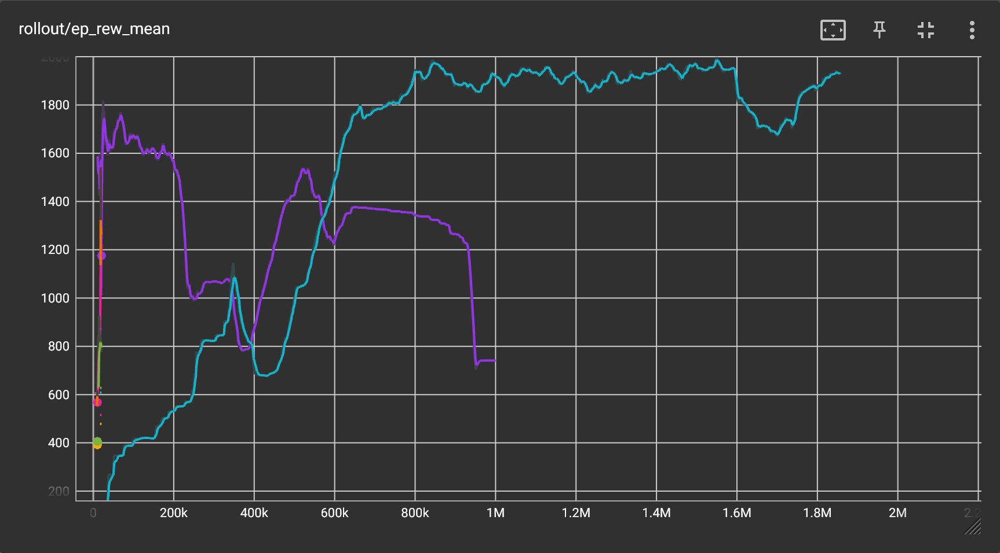

# Super Mario: Report

## 1. Introduction
 - We all know and love the classic Mario game. Here, we present an agent trained to win the game. The agent is based on Reinforcement Learning, basically we give positive feedback or reward to the agent for moving forward in the game, and negative feedback for failing. 
 - Complex algorithms that can learn to predict the moves that maximize our reward, like Proximal Policy Optimization[[1]](https://arxiv.org/abs/1707.06347), were used. The main aim of the project was to learn to apply Reinforcement Learning to a complex environment. RL algorithms are robust and work well for any environment.

    [Add Video]

## 2. Environment Setup
 - For any RL environment, it is important to understand the environment under which it performs its actions. 
 - The agent takes the current game frame as an input, and a reduced set of actions is available to the model; for example, the model is not allowed to move backwards. This may seem bad, but it simplifies the training process.
 - The model is given a slight positive reward for moving forward through the level. The model gets a negative reward with the passage of time to prevent it from standing still. Another negative reward is given on each death. It is important for the chosen reward function to represent what you actually want the agent to do.

## 3. Pre-Processing
 - As mentioned above, the input to the model was a game-frame. To reduce the input size, the game frame was grey-scaled.
 - The agent does not need to perform an action on each frame. Four frames are stacked together and fed to the model as input.
 - The action space of the agent is greatly reduced. No backward movements are allowed.

## 4. About the Algorithm
 - Deep Reinforcement Learning is notorious for being unstable. Proximal Policy Optimization is a somewhat stable and recent development in this field.
 - The basic idea of this algorithm is to maintain a Neural Network that takes the current state of the agent as the input and outputs the ideal probabilities for performing each action (This set of probabilities is called the policy).
 - The algorithm is an online learning algorithm. That is, it does not maintain any kind of replay buffer. Any new data point is used as soon as it is encountered and only once to update this network.
 - The algorithm is stable because it maintains a Clip Ratio. Any update to a policy that exceeds this clip ratio is discarded; this makes each update controlled and incremental.

## 5. Training
 - **Hyper Parameters**: As I said earlier, Deep RL algorithms are famous for being unstable and highly dependent on the choice of hyperparameters. The optuna library was used to find the optimal hyperparameters for the algorithm. It automates the trial-and-error process of selecting ideal parameters. We need to specify the range of possible values for each parameter and a function to optimize and the rest is handled by the library.
 - **Training Environments**: The initial training, mostly the process of finding the ideal hyperparameters, was carried out on my personal laptop. Most of the training process was carried out using cloud GPU providers. Accessing and setting up cloud GPU providers for training was a new learning experience.

 - To visualize the training process, tensorboard was used. We can visualize rewards given by multiple small models at the start; out of those, two were chosen to train for more steps. Additionally, the model saves a copy after completion of every 100k steps. In the end, a model very similar to these models was trained for around 4 million steps, taking around 6-8 hours on a cloud GPU. This model can consistently complete the game and is quite fast.

## 6. Conclusion and Learnings
 - Even though this seems like a very specific environment due to the extendible nature of RL algorithms. This or similar code can be applied to optimize any simulations, which can be used effectively in the field of Robotics.
 - The agent trained here for Mario performs well up to a point in the further levels of the game but cannot optimally perform. This shows that RL agents do not generalize for novel scenarios and must constantly learn to improve.
 - Even though PPO claims to be a relatively stable algorithm, it suffers from stagnation or lack of exploration in the later stages of the game. This is evident from the graphs shown above. To make the agent explore more often, a hyperparameter (i.e., entropy coefficient, 0 by default) needs to be tuned.
 - Running the same Deep RL algorithm twice may result in two completely different graphs because of the random seed. The Algorithms are so unstable that the seed can also be seen as a hyperparameter and should not be set to random.
